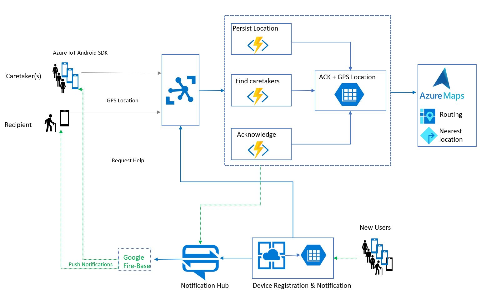

# Welcome
Welcome to Azure IoT Team Hackathon 2019 !

# Title
Accompany, a Mobility Solution for People in Need

# What is Accompany
A SaaS solution to provide mobility support to visually impaired people to get assistance from others, in proximity.

# Why accompany
Existing apps/devices like the smart walking stick that identifies obstacles, or the BeMyEyes, that helps remotely through a live video connection, lack ability to bring people in need together with people who want to assist.

# Outcomes
Accompany-as-a-service that integrates various Azure services to deliver real-time mobility assistance.

# Key learnings
- Discrepancy in dev experience depending on toolset (Portal, VSC, VS, CLI, etc.)
- Room for improving route directions for visually impaired pedestrians
- Lack of geo-fence authoring/drawing tool to generate polygons

# Growth
- Extended for other audiences like elderly people, and for other modes of transportation.
- Improve solution with voice assistance (LUIS)

# Architecture 

TBD: Explain data flow

# Step-by-Step Demo Experience

TBD

# Team
Alex Cortelyou, Alina Stanciu, Ashita Rastogi, Azima Mansuri, Kevin Eger, Patrick Gorman, Roberto Lucchi, Stefan Gawrys, Subbarayudu Kamma, Trang Dinh

